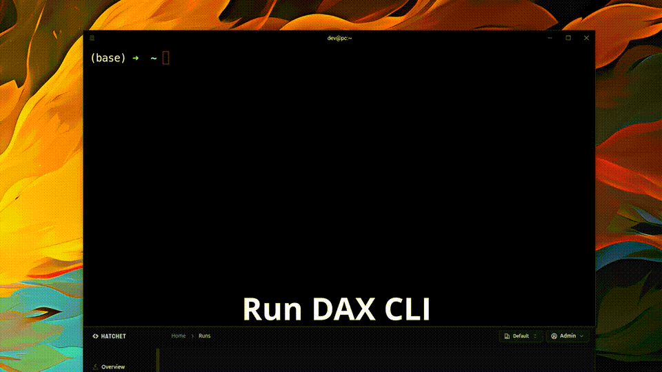
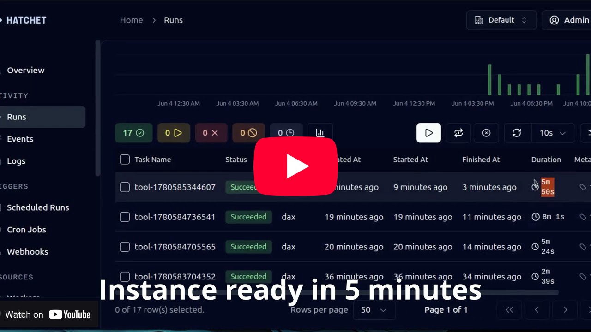

# DAX: AIOps Infra as Code

Build and operate AI infrastructure inside your own cloud with YAML-based workflows at scale. Automate inference, training, and AI agent harnesses in real production environments. Supports spot instances, GPU quota-aware region switching, vibe-coding customization, and more.


<p align="center">
  
</p>


## Supported Cloud Providers
- Google Cloud Platform (✅)
- AWS (future development))
- Azure (future development)

## CLOUD PROVIDER: GCP

*Pre-requisites:*
Enable GPU quota in your cloud project as early as possible. Approval can take up to 48 hours. Without GPU quota, launching GPU VMs may fail with a `GPUS_ALL_REGIONS` quota error. To reduce capacity issues, enable GPU quota across multiple regions.

## ⚡ 5 Minutes Setup
This step installs DAX on the `default` network without a public IP. Cloud NAT is required to enable internet access from inside the VM. You can log in to the VM with `gcloud compute ssh <instance_name>`.

### 1. Create a Service Account (~30 secs)
A service account is required as the owner/executor for provisioning instances, firewalls, and other services. Run this script to set it up. Make sure `gcloud` is installed and authenticated in your terminal.

```
bash <(curl -fsSL https://raw.githubusercontent.com/dagploy/dax/refs/heads/main/scripts/gcp_create_service_account.sh)
```

You will see the new service account created with required permission:

```
"roles/compute.instanceAdmin.v1"
"roles/compute.securityAdmin"
"roles/iam.serviceAccountUser"
"roles/artifactregistry.writer"
"roles/storage.objectUser"
"roles/compute.loadBalancerAdmin"
"roles/dns.admin"
"roles/secretmanager.secretAccessor"
```

This will produce both local service account JSON and secret `dax-service-account-key` that will use for provisioning any VM compute.

### 2. Setup Cloud NAT (~30 secs)
DAX server VM will have no public IP. To enable internet access for downloading packages, we create a cloud NAT

```
bash <(curl -fsSL https://raw.githubusercontent.com/dagploy/dax/refs/heads/main/scripts/gcp_install_cloud_nat.sh)
```

### 3. Create DAX VM service (~30 secs)

Run the command below. Replace `YOUR-SERVICE-ACCOUNT-EMAIL` with the service account email address you created earlier. You can find it in the generated service account JSON file.

Use `--metadata enable-oslogin=TRUE` to restrict access to OS Login, such as a corporate Google account. Use `enable-oslogin=FALSE` for standard SSH-based access.

```bash
gcloud compute instances create dax \
  --service-account=YOUR-SERVICE-ACCOUNT-EMAIL \
  --scopes=cloud-platform \
  --zone=us-central1-a \
  --machine-type=e2-custom-4-8192 \
  --boot-disk-size=60GB \
  --boot-disk-type=pd-balanced \
  --image-family=debian-12 \
  --image-project=debian-cloud \
  --network=default \
  --subnet=default \
  --no-address \
  --tags=dax \
  --metadata enable-oslogin=FALSE,startup-script='#!/bin/bash
set -e
apt-get update
DEBIAN_FRONTEND=noninteractive apt-get install -y git
'
```

### 4. Install DAX (~3 minutes)
SSH into the machine with `gcloud compute ssh dax` and run the installation step. DAX will be installed in your `user` folder.

```
sudo bash -c "$(curl -fsSL https://raw.githubusercontent.com/dagploy/dax/refs/heads/main/scripts/gcp_install.sh)"
```

Congrats, now DAX already installed and running 🎉

You can check the service with

```
sudo -iu dax -- tmux attach -t dax
```

## 💻 Connect with CLI
Any provisioning can be instructed to DAX server via curl or CLI. Connect your laptop/computer with DAX server via SSH tunnelling.

### 1. Install CLI
The detailed steps can be read here:
[Install DAX CLI (examples/project/dax-cli) ](examples/project/dax-cli)


### 2. Tunnelling to DAX server
Run this command to establish connection securely over public internet. There are two ports: 8001 (DAX) and 8080 (Dashboard via Hatchet)

```
gcloud compute ssh dax --zone us-central1-a --tunnel-through-iap -- -L 8001:localhost:8001 -L 8080:localhost:8080
```

You can access the dashboard via https://localhost:8080 or curl provisioning into https://localhost:8001

## EXAMPLE USE CASE


### Run GPT OSS 20B in your cloud from scratch just takes *15 minutes*.

[](https://youtu.be/8tw6TdZipaw)

Start by caching Docker images and models first — around 100GB in total — then launch the workload from the cache.

This cache mechanism can reduce startup time by up to 80% and lower costs by avoiding idle GPU time while large files are downloaded over the network.

**Step 1: Cache the VLLM docker**  
```
dax run download_docker vllm/vllm-openai:nightly,ghcr.io/open-webui/open-webui:main --images vllm-lib --image-size 100
```

**Step 2: Cache GPTOSS 20B from Huggingface**  
```
dax run download_hf openai/gpt-oss-20b --image-size 50
```

**Step 3: Run the inference**

```
dax run create_vm_inference --stack-name gptoss --config-json '{"images":["models--openai--gpt-oss-20b","vllm-lib"]}' --model openai/gpt-oss-20b
```

Or longer version

```
dax run create_vm_inference --stack-name gptoss --config-json '{"images":["models--openai--gpt-oss-20b","vllm-lib"]}' --model https://huggingface.co/openai/gpt-oss-20b

```

Access it from your laptop/computer via tunneling

```
gcloud compute ssh gptoss -- -L 8000:localhost:8000 -L 8081:localhost:8080
```

This will forwarding openwebui via http://localhost:8081 and VLLM API via http://localhost:8000

## FAQ

### 1. My project is not changed
`Property [project] is overridden by environment setting [CLOUDSDK_CORE_PROJECT`. 
This is not DAX problem, but your local machine. 

The solution: `unset CLOUDSDK_CORE_PROJECT`


### 2. Error launching: stack_name project_name program work_dir opts
```
local_workspace.py", line 1011, in create_or_select_stack
    raise ValueError(f"unexpected args: {' '.join(args)}")
ValueError: unexpected args: stack_name project_name program work_dir opts
```

1. Make sure the project path value defined in `pulumi_yaml/Pulumi.yaml` is correct.
2. Check if anything in `.env` is already correct. 
3. Check on `config/env/dev.yaml` and make sure the value of project and service account is correct.

```
project_name: GCP_PROJECT_NAME
gcp:project: GCP_PROJECT_NAME
gcp:serviceAccount: SERVICE_ACCOUNT_EMAIL_ADDRESS
```

### 3. Error network
If you have problem with access to internet:

```
W: Failed to fetch https://deb.debian.org/debian/dists/bullseye/InRelease Cannot initiate the connection to`
debian.map.fastly.net:443 (2a04:4e42::644). - connect (101: Network is unreachable) Cannot initiate the connection to 
debian.map.fastly.net:443 (2a04:4e42:200::644). - connect (101: Network is unreachable) Cannot initiate the connection to 
```

Or COS NVIDIA Driver installation stuck 
```
Unable to find image 'us.gcr.io/cos-cloud/cos-gpu-installer:v2.7.2' locally
docker: Error response from daemon: Get "https://us.gcr.io/v2/": net/http: request canceled while waiting for connection (Client.Timeout exceeded while awaiting headers).
See 'docker run --help'.
Error: Failed to install GPU driver: could not install GPU drivers: failed to complete installation using installer 'us.gcr.io/cos-cloud/cos-gpu-installer:v2.7.2': exit status 125
```

This means the cloud NAT not working, the proxy haven't setup in correct way or the subnet haven't granted with google private access permission. Cloud NAT works at `regional` level, not global. To enable NAT and subnet, run this 

```
bash scripts/gcp_install_cloud.nat.sh
``` 

## DAX Cloud Services
We are working on the cloud services and AI Infra agents. If you are interested, you can join the waiting list or contact us for custom inquiry : [https://www.dagploy.com/contact](https://www.dagploy.com/contact)


## Contributing
Visit [CONTRIBUTING.md](./contributing.md) for information on building DAX from source or contributing improvements.

## License
DAX is released under the Apache License 2.0. See [LICENSE](./LICENSE) for the full text.

## Citation
If you use DAX in your research, please cite:

```
@misc{dax,
  title = {DAX: AIOps Infra as Code},
  author = {DAGPLOY},
  year = {2026},
  url = {https://github.com/dagploy/dax}
}
```