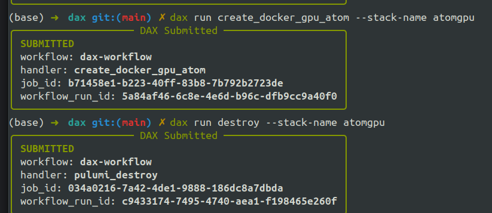
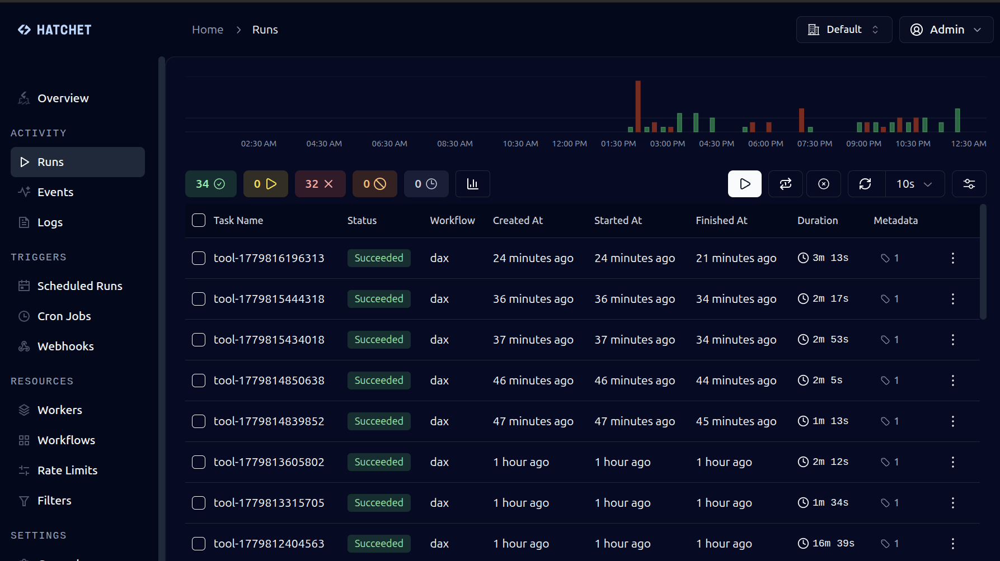

# DAX CLI
CLI  for running DAX commands, such as provisioning VM or launching a model.

## Quickstart

```
git clone https://github.com/dagploy/dax.git
cd dax/examples/project/dax-cli
pip install -e .
```

Make sure you alread logged into your google project. If not, you can run

```
gcloud auth login
gcloud config set project <YOUR_PROJECT>
```

Start tunneling to DAX server in the project.

```commandline
gcloud compute ssh dax --zone us-central1-a --tunnel-through-iap -- -L 8001:localhost:8001 -L 8888:localhost:8888
```

The port `8001` is contains the `API` for DAX that receive CLI request. The port `8888` is Hatchet dashboard.

## Example

You can run several commands like 

Cache the HF model:
```
dax run download_hf openai/gpt-oss-20b --image-size 50
```

Cache docker image:
```
dax run download_docker \                             
  vllm/vllm-openai:nightly,ghcr.io/open-webui/open-webui:main \
  --images vllm-lib \
  --image-size 100 \
  --config-json '{"errorDestroy": false}'
```

Run LLM inferencing with VLLM and cached model and docker
```
dax run create_vm_inference --stack-name gptoss --config-json '{"images":["models--openai--gpt-oss-20b","vllm-lib"]}' --model https://huggingface.co/openai/gpt-oss-20b
```

Destroy the stack 
```
dax run destroy --stack-name gptoss
```

Launch GPU VM with different instance
```
dax run launch_vm_gpu \
  --config-json '{
    "machineType": "g4-standard-48"
  }'
```

The `--config-json` will override the existing config in `config/env/dev.yaml`. This is useful for AI agent or dynamic environment to avoid editing files or reloading configuration.




## Check Status
To check status via `http://localhost:8888` and login using Hatchet default 

```
Username: admin@example.com 
Password: Admin123!!
```



Instance VM will have same name as stack name. You can ssh directly with

```
gcloud compute ssh STACK_NAME
```

## ACCESS to DAX Docker
After SSH, check if `daxrun` already running

```
docker ps
docker exec -it dax bash
```
